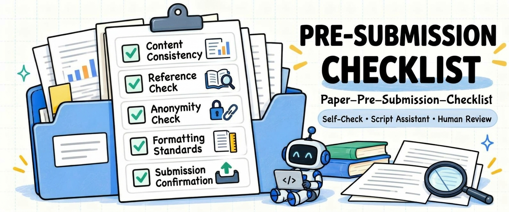

<h1 align="center">✅ Paper Pre-Submission Checklist</h1>

<p align="center">
  <a href="https://img.shields.io/badge/version-v0.1.0-blue">
    </a>
  &nbsp;
  <a href="LICENSE">
    </a>
  &nbsp;
  <a href="https://github.com/MLNLP-World/Paper-Pre-Submission-Checklist/stargazers">
    </a>
  &nbsp;
  <a href="https://github.com/MLNLP-World/Paper-Pre-Submission-Checklist/network/members">
    </a>
  &nbsp;
  <a href="https://github.com/MLNLP-World/Paper-Pre-Submission-Checklist/issues">
    </a>
  &nbsp;
  <a href="https://github.com/MLNLP-World/Paper-Pre-Submission-Checklist/pulls">
    </a>
</p>

A checklist for final pre-submission review of papers, focusing on concrete pre-submission errors that can be directly located and fixed. The project includes a complete checklist, a quick checklist, and the `autocheck` automated checking script, helping everyone systematically hunt down errors that might otherwise slip through, so as to avoid a Desk Reject after submission.

<div align="center">

[中文](./README.md) | English

</div>



## Table of Contents

- [Features](#features)
- [How to Use](#how-to-use)
- [Complete Checklist](#complete-checklist)
  - [Main Content Checks](#main-content-checks)
  - [Cross-Paper Consistency Checks](#cross-paper-consistency-checks)
  - [Submission Materials and Final Upload Checks](#submission-materials-and-final-upload-checks)
- [Quick Checklist](#quick-checklist)
- [Automated Checking Tool](#automated-checking-tool)
- [Disclaimer](#disclaimer)
- [Feedback and Contributing](#feedback-and-contributing)
- [Acknowledgments](#acknowledgments)

## Features

- **Objective and unambiguous**: every check item can be answered with a clear "yes" or "no", leaving no gray areas.
- **Easy to act on**: once a problem is found, you can quickly locate the specific section, figure, table, or file.
- **Comprehensive coverage**: covers the main text, appendix, supplementary materials, the final PDF, and the submission system.
- **Fast and practical**: when the deadline is approaching, you can jump straight to the quick checklist at the end.
- **Script-assisted**: an automated checking script is included — items a machine can verify are scanned with one command, and the rest is left to item-by-item manual review against the checklist.

## How to Use

1. Before submitting, go through the [Complete Checklist](#complete-checklist) item by item;
2. After every revision of the paper, focus on re-checking "[Cross-Paper Consistency Checks](#cross-paper-consistency-checks)";
3. After uploading the paper, complete "[Submission Materials and Final Upload Checks](#submission-materials-and-final-upload-checks)";
4. If time is really short, at least complete the "[Quick Checklist](#quick-checklist)" at the end.
5. The project includes an [automated checking script](#automated-checking-tool) that can quickly verify items that machines can check.

## Complete Checklist

### Main Content Checks

#### 1. Title and Abstract

- [ ] The method name in the title matches the spelling and capitalization used in the main text.
- [ ] All abbreviations are defined at their first occurrence in the abstract.
- [ ] Dataset, model, and metric names in the abstract are consistent with the main text.
- [ ] Experimental numbers in the abstract match the results in the main text.
- [ ] Performance improvement figures in the abstract are calculated correctly.
- [ ] The abstract length meets the submission requirements.

#### 2. Introduction

- [ ] The method name is consistent across the title, abstract, and method section.
- [ ] All abbreviations are defined at their first occurrence.
- [ ] The contribution list is numbered consecutively, with no duplicates or gaps.
- [ ] Experimental numbers in the introduction match those in the experiments section.
- [ ] Figure, table, section, and citation numbers are correct.
- [ ] No outdated method names or experimental results from previous versions remain.

#### 3. Method

- [ ] Every mathematical symbol is defined at its first occurrence.
- [ ] Each mathematical symbol has a single, consistent meaning throughout the paper.
- [ ] Variables are written consistently across equations, text, algorithms, and figures.
- [ ] All equation numbers and in-text references to them are correct.
- [ ] Module names in method figures match those in the text.

#### 4. Experimental Setup and Results

- [ ] Datasets, models, evaluation metrics, and experimental settings are consistent between the main text and the appendix.
- [ ] The best (e.g., bold) and second-best (e.g., shaded or underlined) results in tables are marked correctly, and the direction of improvement for each metric is clearly indicated ("↑" higher is better or "↓" lower is better).
- [ ] Averages and performance improvements in tables are calculated correctly.
- [ ] Experimental results repeated across the main text, tables, and appendix are consistent.

#### 5. Related Work and References

- [ ] The title, authors, year, and venue of each cited paper are accurate, with no hallucinated references.
- [ ] arXiv papers are not mistakenly marked as formally published.
- [ ] All datasets, models, and toolkits used are properly cited.
- [ ] No paper appears more than once in the reference list.
- [ ] Author names and years cited in the text match the reference list.
- [ ] URLs, DOIs, and arXiv links are accessible.

#### 6. Conclusion, Appendix, and Supplementary Materials

- [ ] Experimental numbers in the conclusion match the main text.
- [ ] The conclusion contains no new results that were not reported in the main text.
- [ ] Every appendix section is referenced in the main text.
- [ ] Numbers, hyperparameters, and settings are consistent between the main text and the appendix.
- [ ] Figure, table, equation, and section numbers in the appendix and supplementary materials are correct.
- [ ] Supplementary materials open properly and contain the final version.

#### 7. Figures and Tables Throughout the Paper

- [ ] Data plots and architecture diagrams are in vector format; bitmap images are sharp and free of distortion or cropping.
- [ ] Text in figures is clearly legible at 100% zoom in the paper.
- [ ] Axes, units, legends, and subfigure labels are complete and correct.
- [ ] Data and result annotations in figures and tables match the text.
- [ ] No figure or table extends beyond the page, and all are correctly referenced in the text.

### Paper Consistency Checks

#### 8. Consistency of Experimental Results

- [ ] Numbers in the abstract match the main results table.
- [ ] Numbers in the introduction match the experiments section.
- [ ] Numbers in the conclusion match the main text.
- [ ] The same result is consistent when it appears in different tables.
- [ ] Results repeated in the main text and appendix are consistent.
- [ ] All averages, differences, and improvement ratios are calculated correctly.
- [ ] Every number in the text has a corresponding source in a figure or table.

#### 9. Terminology and Notation Consistency

- [ ] The spelling and capitalization of the method name are consistent throughout.
- [ ] Dataset, model, and baseline names are consistent throughout.
- [ ] Evaluation metric names are consistent throughout.
- [ ] The same concept is not referred to by multiple different names.
- [ ] The same abbreviation is not defined more than once.
- [ ] Mathematical symbols, subscripts/superscripts, bold, and italic formatting are consistent.

#### 10. Citations and Cross-References

- [ ] The PDF contains no `[?]` or `??`.
- [ ] There are no unresolved references such as "Figure ?", "Table ?", or "Equation ?".
- [ ] Every work cited in the text appears in the reference list.
- [ ] All figures, tables, equations, sections, and appendices are correctly referenced.
- [ ] Figure, table, equation, section, and appendix numbers are consecutive and non-duplicated.
- [ ] Internal and external links in the PDF open properly.
- [ ] Parenthetical and narrative citations are used correctly (incorrect: As shown in (Smith et al., 2020); correct: As shown in Smith et al. (2020)).

#### 11. Spelling and Leftover Content

- [ ] The paper is free of obvious spelling errors and duplicated words.
- [ ] Method, dataset, and model names are spelled correctly.
- [ ] The paper contains no `TODO`, `TBD`, `XXX`, or `FIXME`.
- [ ] The paper contains no author comments, highlights, strikethroughs, or tracked changes.
- [ ] No old method names, old experimental results, or template placeholder text remains.
- [ ] No LaTeX commands appear directly in the PDF.
- [ ] There are no unclosed brackets, quotation marks, or abnormal punctuation.

#### 12. PDF Rendering and Layout

- [ ] The PDF has no blank, missing, or duplicated pages.
- [ ] No figure, table, equation, or text extends beyond the page margins.
- [ ] Images are not distorted, cropped, or failing to render.
- [ ] Headers, footers, and page numbers comply with the template requirements.
- [ ] Fonts are properly embedded in the PDF.
- [ ] Text in the PDF is searchable and copyable.

### Submission Materials and Final Upload Checks

#### 13. Submission Requirements

- [ ] The final template required by the target conference or journal is used.
- [ ] Page count, fonts, margins, and file size meet the submission requirements.
- [ ] The way reference and appendix pages are counted complies with the requirements.
- [ ] Required statements such as the Checklist, Limitations, or Ethics Statement are included.
- [ ] The file formats of the main paper and supplementary materials meet the requirements.

#### 14. Anonymity (if required)

- [ ] The PDF body contains no author names, affiliations, emails, or acknowledgments.
- [ ] The PDF metadata contains no author names.
- [ ] File names contain no author or affiliation information.
- [ ] Supplementary materials contain no information that reveals author identity.
- [ ] Figures, screenshots, and code snippets contain no usernames or local paths.
- [ ] GitHub, cloud-drive, and project homepage links do not reveal author identity.
- [ ] Self-citation phrasing complies with the anonymity requirements of the target venue.

#### 15. Submission Files and System Information

- [ ] Both the uploaded main paper and supplementary materials are the final versions.
- [ ] The title and abstract in the submission system match the final PDF.
- [ ] Author names, order, emails, and affiliations are correct.
- [ ] Keywords, research areas, and the submission track are selected correctly.
- [ ] The main paper and supplementary materials are uploaded to the correct locations.
- [ ] No old or commented version was uploaded by mistake.

#### 16. Final Confirmation After Upload

- [ ] The main paper has been re-downloaded from the submission system and checked.
- [ ] The downloaded PDF has the correct page count, and figures, tables, and equations render properly.
- [ ] Supplementary materials were uploaded successfully and open properly.
- [ ] The submission status shows "Submitted" or "Submission Complete".
- [ ] All authors have confirmed the final version.
- [ ] The final files and the submission confirmation have been saved.

## Quick Checklist

When the deadline is near, at least go through the following items.

#### 1. Content Checks

- [ ] The method name is used consistently in the title, abstract, and main text.
- [ ] Experimental numbers are consistent across the abstract, main text, tables, and conclusion.
- [ ] Equation, symbol, and figure/table numbers are correct and all are referenced in the text.
- [ ] All references actually exist, with correct authors, titles, years, and venues.
- [ ] The PDF contains no leftover `[?]`, `??`, `TODO`, `FIXME`, or author comments.

#### 2. Anonymity Checks

- [ ] The main text, acknowledgments, footnotes, and headers contain no author names or affiliation information.
- [ ] Supplementary materials, code archives, and PDF file properties (metadata) reveal no author information.
- [ ] Code or project links use anonymized links (e.g., Anonymous GitHub).

#### 3. Layout and File Verification

- [ ] The latest template required by the target conference/journal is used (pay attention to single/double column, fonts, and page numbers).
- [ ] The total page count (and main-text page count) and file size are within the submission system limits.
- [ ] All figures are clear, with no cropping, distortion, or overflow beyond the page.
- [ ] The PDF and supplementary materials reveal no author identity.
- [ ] Both the main paper and supplementary materials are final versions and open properly.

#### 4. Submission Confirmation

- [ ] The title, abstract, author order, and uploaded files in the submission system are correct.
- [ ] The main paper and supplementary materials are the latest versions and open properly in different PDF readers after download.

## Automated Checking Tool

Manual review against a checklist inevitably misses things, so the project ships a lightweight Python-based checking script to quickly scan the items a machine can verify first.

> **Note**: the automated tool is only an aid to manual checking — it cannot replace semantic and logical review. Please use it together with the checklist above.

> **Text extraction limitation**: this tool does not perform OCR. If no usable text can be extracted from a page, the report will list the page number and mark it as "Not Checked", indicating that text-related checks could not be completed for it, and `All Clear!` will not be shown. Other pages, as well as metadata and format checks, are unaffected. Even when a page yields partial text, text embedded in images still requires manual review.

### Installation

You can run it with the [online Colab](https://colab.research.google.com/github/MLNLP-World/Paper-Pre-Submission-Checklist/blob/main/autocheck.ipynb), or install it locally:

**Option 1: Clone the repository and install locally**

```bash
# clone
git clone https://github.com/MLNLP-World/Paper-Pre-Submission-Checklist.git

cd Paper-Submission-Checklist/

# install locally (editable mode)
pip install -e .
```

**Option 2: Install directly from GitHub**

```bash
pip install git+https://github.com/MLNLP-World/Paper-Pre-Submission-Checklist.git
```

### Basic Usage

Check a single PDF file:

```bash
autocheck your_paper.pdf
```

Recursively check all PDFs in a folder:

```bash
autocheck ./paper_folder/
```

### Common Options

Switch the report language (supports `zh` Chinese / `en` English; default is Chinese):

```bash
autocheck your_paper.pdf --lang en
```

Skip the time-consuming network dead-link check (offline reference deduplication and anonymous-link checks still run):

```bash
autocheck your_paper.pdf --disable_link_check
```

Configure page limits for the target venue (e.g., single-blind/double-blind page caps):

```bash
autocheck your_paper.pdf --max_pages 8
```

Adjust the image resolution threshold, or manually specify a fixed margin (the text block is inferred automatically by default):

```bash
autocheck your_paper.pdf --min_dpi 200 --margin_pt 36
```

Speed up batch checking with multiprocessing:

```bash
autocheck ./paper_folder/ --num_workers 4
```

### Parameter Reference

| Parameter | Description | Default |
| --- | --- | --- |
| `--lang {zh,en}` | Report output language | `zh` |
| `--disable_link_check` | Disables only the URL network dead-link check; offline reference deduplication and anonymous-link checks are kept | Network check enabled by default |
| `--max_pages N` | Maximum page limit | Not checked by default |
| `--min_dpi N` | Minimum image resolution threshold (DPI) | `150` |
| `--margin_pt N` | Fixed inset from the text block for margin-overflow checks (pt) | Inferred automatically by default |
| `--num_workers N` | Number of worker processes for parallel processing | `1` |

**Command exit codes**: `0` means the checks ran normally (whether the paper has errors, warnings, or unchecked content is determined by the report); `1` means at least one PDF failed to be read or checked; `2` means invalid input (e.g., the path does not exist, the specified file is not a PDF, or the specified directory contains no PDFs) or a command-line argument error. In batch processing, if invalid input or corrupted files are encountered, the remaining valid files are still checked, and a non-zero exit code is returned in the end; if both invalid input and PDF processing failures occur, the exit code is `2`.

### Currently Supported Automated Checks

**1. File Properties and Layout**

* **File size**: a notice is given when the file exceeds 10 MB.
* **Page count**: set an upper limit via `--max_pages`; exceeding it raises an error; not checked by default.
* **Blank pages**: detects pages with no text, no bitmap images, and no vector graphics.
* **Font embedding**: checks for non-embedded fonts; non-embedded standard fonts (the Base-14 fonts such as Times, Helvetica) are downgraded to warnings.
* **Image resolution**: bitmaps below the threshold (150 DPI by default, adjustable with `--min_dpi`) are flagged as possibly blurry.
* **Margin overflow**: automatically infers the single/double-column text block and checks whether text and images overflow horizontally, automatically excluding page numbers, review line numbers, and headers; a fixed margin can also be set with `--margin_pt`. Only horizontal overflow is checked — top/bottom margins and overall template changes require manual review.

**2. Anonymity**

* **Metadata**: an error is raised if the Author field contains a suspected real name (placeholder values such as `Anonymous` are exempt); a warning is given if the Creator or Producer field retains a local compilation path (which may contain the computer username); compiling with Word triggers a suggestion to switch to LaTeX.
* **First-page content**: detects affiliation keywords (University, Institute, etc.) and email addresses on the first page.
* **Acknowledgments**: a reminder to check anonymity requirements is given when an Acknowledgments section appears.
* **Links**: when links to GitHub, cloud drives, personal homepages, etc. appear in the text or annotations, a prompt suggests replacing them with anonymous links (e.g., Anonymous GitHub). This check is purely offline.

**3. Content and References**

* **Unresolved references and draft markers**: unresolved references such as `[?]`, `??`, `Figure ?`, and draft markers such as `TODO`, `FIXME`, `TBD`, `XXX`.
* **Low-level errors**: consecutive duplicated words (e.g., `the the`), consecutive or isolated abnormal punctuation, lowercase figure/table references (should be `Figure 3`, `Table 2`), and unbalanced brackets.
* **Figure/table numbering gaps**: a notice is given when the Figure and Table numbers mentioned in the text have gaps.

**4. External Links and References**

* **Dead-link detection**: checks the accessibility of links and DOIs via HTTP requests; 404/410 are reported as dead links, and other abnormal statuses are flagged for manual review. Only public ports 80/443 are accessed; links blocked by security policies are marked as "Not Checked". Network checks can be disabled with `--disable_link_check`.
* **Duplicate references**: splits reference entries using PDF column layout, hanging indents, and author/year information, supporting both numbered and common unnumbered bibliography styles; duplicates are detected via entry-text similarity, and entries with identical titles are reported as errors directly. When part of the content cannot be split into entries, the tool continues checking the recognized entries while marking "Not Checked" with the relevant page numbers — partial checking is never treated as a full pass. Scanned pages or complex layouts still require manual review.

### Conditions That Trigger Warnings / Errors

| Check Item | Warning Trigger | Error Trigger |
| --- | --- | --- |
| File size | Exceeds 10 MB | — |
| Page count | — | `--max_pages` specified and page count exceeded |
| Blank pages | — | A page has no text, bitmap, or vector graphics |
| Font embedding | Non-embedded fonts are Base-14 standard fonts | Non-embedded non-standard fonts exist |
| Image resolution | DPI below the threshold (default 150) | — |
| Margin overflow | Text or images overflow the text block horizontally | — |
| Metadata author | — | Author is non-empty and not an anonymous placeholder |
| Metadata local path | Creator/Producer contains a local absolute path | — |
| Compilation tool | Creator is Word | — |
| First-page affiliation/email | Affiliation keywords or email appear on the first page | — |
| Acknowledgments | An Acknowledgments section is present | — |
| Identity-revealing links | Links to GitHub, cloud drives, personal homepages, etc. appear | — |
| Unresolved references | — | `[?]`, `??`, `Figure ?`, etc. appear |
| Draft markers | — | `TODO`, `FIXME`, `TBD`, `XXX` appear |
| Duplicated words | Consecutive duplicated words (e.g., `the the`) appear | — |
| Abnormal punctuation | Consecutive duplicated or isolated punctuation appears | — |
| Figure/table reference casing | Lowercase `figure 3`, `table 2`, etc. appear | — |
| Bracket balance | Opening and closing bracket counts mismatch | — |
| Figure/table numbering gaps | Gaps exist in Figure/Table numbering | — |
| Dead links | Link cannot be confirmed automatically (403, timeout, etc.) | Link returns 404/410 |
| Duplicate references | Entry texts are highly similar | Two entries have identical titles |

> Besides Warnings and Errors, the report may also show "Not Checked": when a page yields no extractable text, a link is blocked by access boundaries, a bibliography section cannot be parsed, figure/table numbers have too many digits, etc., the corresponding check cannot be completed and requires manual review.

> For checking hallucinated references (fabricated or non-existent citations), we recommend using [Paper-BibChecker](https://github.com/MLNLP-World/Paper-BibChecker) to verify the bib file of your paper.

## Disclaimer

This checklist is for reference only and does not guarantee coverage of all submission issues. Requirements (Guidelines) vary across conferences and journals — **always defer to the official requirements of your target conference/journal**. The automated checking tool is based on PDF text parsing and heuristic rules, and may produce false negatives or false positives; layout misalignment, semantic errors, and image distortion in particular require manual review. When using this checklist and the associated scripts, authors are solely responsible for the final quality of their papers, double-blind compliance, and any risk of violations; this project assumes no liability for rejections or score deductions caused by missed issues.

## Feedback and Contributing

This project is improved through the power of the community. If you encounter problems while using it, have check items to suggest, or find bugs in the tool scripts, feel free to open a GitHub Issue; you are also welcome to fork this repository and submit Pull Requests with improvements!

## Acknowledgments

### Organizers

Thanks to the following members for organizing and guiding this project:

<p align="left">
  <a href="https://github.com/WPENGxs">
    </a>
  &nbsp;&nbsp;
  <a href="https://github.com/qinlibo-hit">
    </a>
</p>

### Contributors

Thanks to the following members for their support and contributions to this project:

<p align="left">
  <a href="https://github.com/WPENGxs">
    </a>
  &nbsp;&nbsp;
  <a href="https://github.com/Hxs23">
    </a>
</p>
